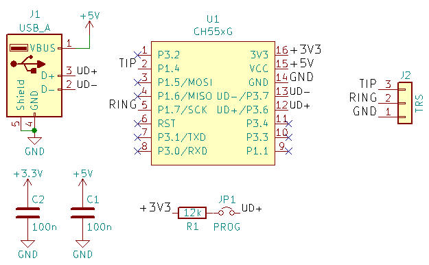
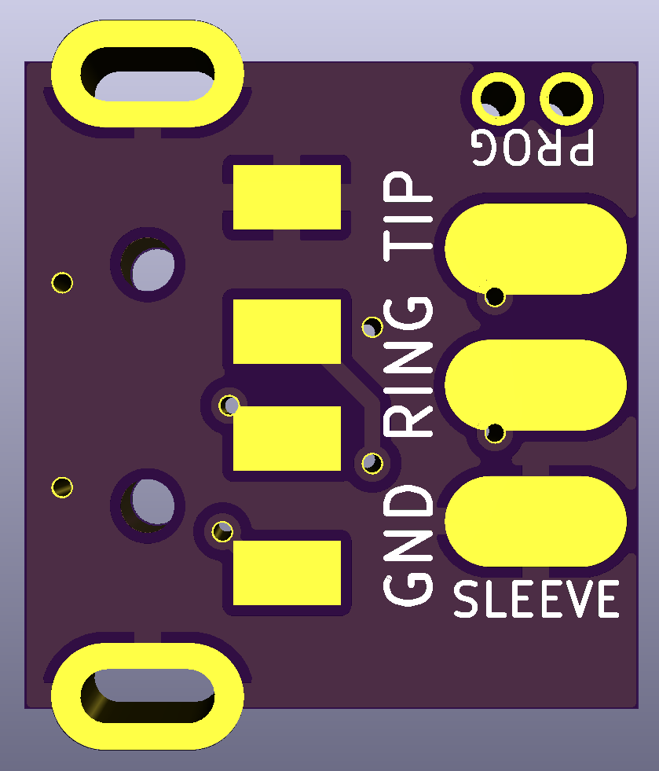
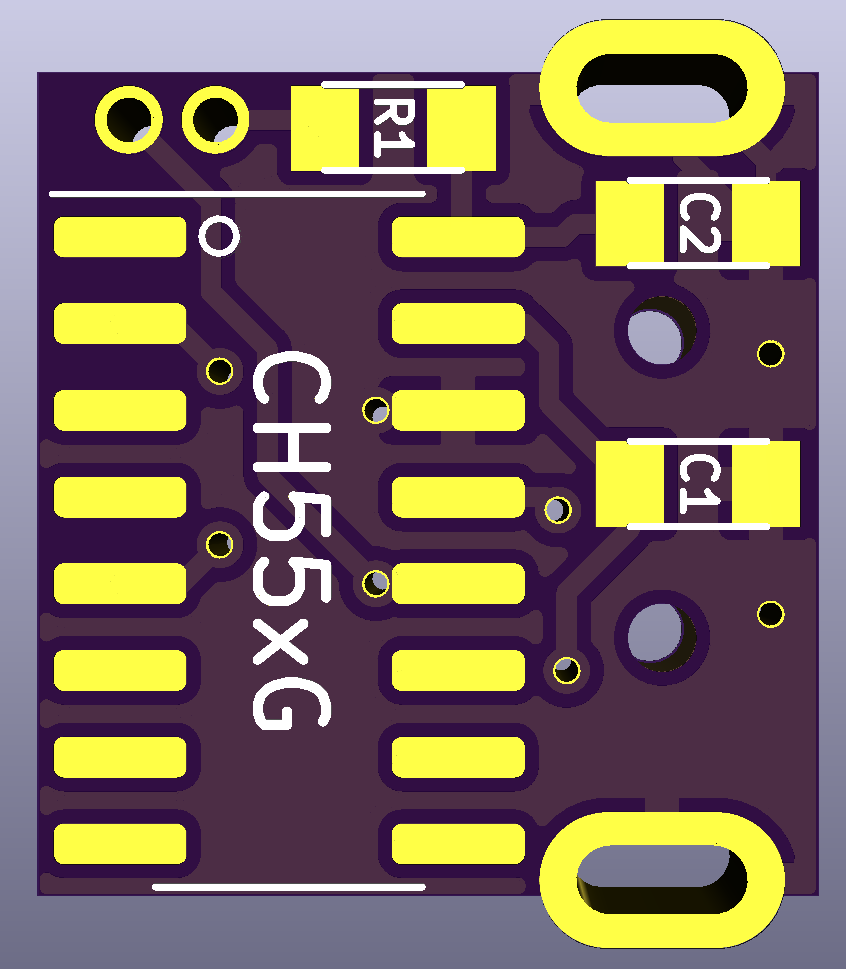
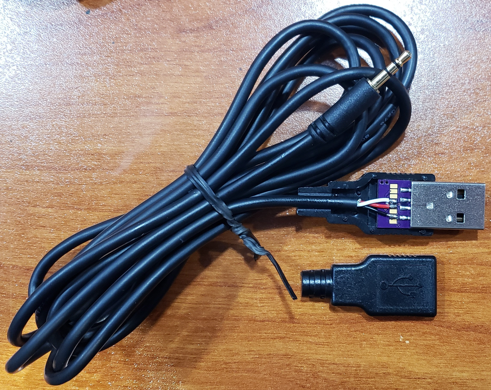
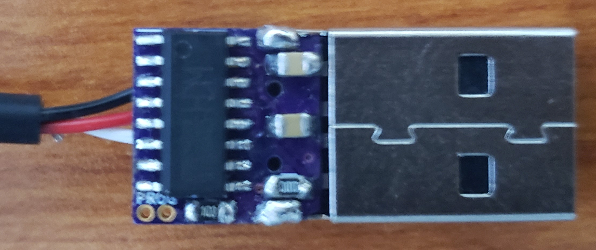

# CH55xGrayLink
A sketch for CH551/CH552 based Arduinos (using [Ch55xduino](https://github.com/DeqingSun/ch55xduino)) that makes it possible to connect a Texas Instruments calculator to a computer using USB.

## Introduction
This sketch allows a computer to connect to and transfer data to/from a TI graphing calculator over USB.
It is a port of the *serial2ti83* Arduino sketch for Arduino Nano/Uno found [here](https://github.com/MTres19/serial2ti83).
In order to use it, compile and upload `CH55xGrayLink.ino` to a CH551 or CH552 [Ch55xduino](https://github.com/DeqingSun/ch55xduino) board using the Arduino IDE.

## Wiring
Connect the following pins to the 2.5mm port located at the bottom of the TI calculator according to the following table:

| 2.5mm port    | CH55x         | 
|:-------------:|:-------------:|
| tip           | P1.4          |
| ring          | P1.7          |
| sleeve        | GND           |

## Transfer Speed
Max reported transfer speed seems to be about 2.9 KB/s based on testing done to date.

## Arduino Settings
First, install Ch55xduino according to the instruction found here: https://github.com/DeqingSun/ch55xduino#installation

Then, select the CH551 Board (or CH552 Board) and adjust the other settings to match below.

Adjust *Port* as needed.  May need to use Device Manager to force the port to COM1-4 for TI programs to actually see it.

## Schematic

## PCB
Designed to fit within a standard USB-A male port housing.

Gerbers: `pcb/output/gerber.zip`

PCBs available from: [OSHPARK](https://oshpark.com/shared_projects/HASfmay6)

## Finished Cable
Note: This is picturing an older PCB (from a different project), but the optimized PCB available above is basically the same thing.

